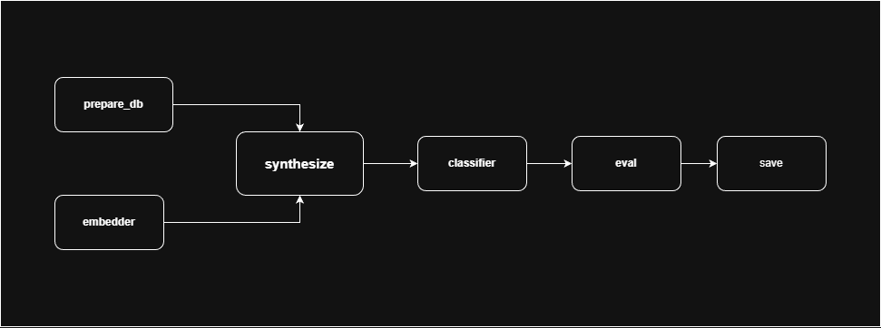

### How to perform an experiment

The code base was structured into the following pipeline. To perform a sweep experiment, we use the in-file config with the following options:

```python
if __name__ == "__main__":

    DB_LIST = [
        "drybean",
        "adult",
        "bank",
        "credit",
        "covertype",
        "airlines",
        "higgs",
    ]

    EMBEDDERS = [
        "ln_res",
        "ln_wide",
    ]

    SYNTH_TYPES = [
        "dm_moments",
        "dm_standard",
    ]

    CLASSIFIERS = [
        "mlp",
        "logreg",
    ]

    MOMENTS = [
        {"name": "M1", "max_moment": 1},
        {"name": "M2", "max_moment": 2},
        {"name": "M3", "max_moment": 3},
        {"name": "M4", "max_moment": 4},
    ]

    RESULTS_DIR = "./results_moments"
    ensure_dir(RESULTS_DIR)

    for db in DB_LIST:
        for embedder in EMBEDDERS:
            for synth_type in SYNTH_TYPES:
                for classifier in CLASSIFIERS:
                    for exp in MOMENTS:

                        save_dir = os.path.join(
                            RESULTS_DIR,
                            db,
                            embedder,
                            synth_type,
                            classifier,
                            exp["name"],
                        )

                        config = {
                            "dataset_name": db,
                            "save_dir": save_dir,
                            "device": "cuda" if torch.cuda.is_available() else "cpu",

                            # Synthesis
                            "synth_type": synth_type,
                            "ipc": 10,
                            "dm_iters": 2000,
                            "dm_lr": 0.05,
                            "dm_batch_real": 256,

                            # Embedder
                            "dm_embedder_type": embedder,
                            "dm_embed_hidden": 256,
                            "dm_embed_dim": 128,

                            # Moments
                            "max_moment": exp["max_moment"],

                            # Classifier
                            "classifier": classifier,
                            "classifier_hidden": [128, 64],
                            "classifier_epochs": 20,

                            # Reproducibility
                            "random_seed": 42,
                        }

                        run_dm_moment_experiment(config)
```
## Registries

### 📊 Dataset registry  
*Location:* `data/prepare_database.py`

| Key         | Dataset name     |
|-------------|------------------|
| `adult`     | Adult Income     |
| `bank`      | Bank Marketing   |
| `credit`    | Credit Default   |
| `drybean`   | Dry Bean         |
| `covertype` | Forest Covertype |
| `airlines`  | Airlines         |
| `higgs`     | HIGGS            |

---

### Synthesizer registry  
*Location:* `synth/registry.py`

| Key          | Category          | Teacher required |
|--------------|-------------------|------------------|
| `dm_ln`      | Condensation      | No               |
| `dm_bn`      | Condensation      | No               |
| `dm_moments` | Condensation      | No               |
| `bn_stats`   | Teacher matching  | Yes              |
| `random_ipc` | Coreset           | No               |
| `vq`         | Coreset           | No               |
| `voronoi`    | Coreset           | No               |
| `gonzalez`   | Coreset           | No               |

---

### Embedder registry  
*Location:* `models/embedders.py`

| Key           | Normalization | Architecture |
|---------------|---------------|--------------|
| `bn`          | BatchNorm     | Shallow      |
| `bn_deep`     | BatchNorm     | Deep         |
| `bn_wide`     | BatchNorm     | Wide         |
| `bn_res`      | BatchNorm     | Residual     |
| `bn_cascade`  | BatchNorm     | Cascade      |
| `ln`          | LayerNorm     | Shallow      |
| `ln_deep`     | LayerNorm     | Deep         |
| `ln_wide`     | LayerNorm     | Wide         |
| `ln_res`      | LayerNorm     | Residual     |
| `ln_cascade`  | LayerNorm     | Cascade      |

---

### Classifier registry  
*Location:* `models/classifiers.py`

| Key   | Classifier            |
|-------|-----------------------|
| `mlp` | Multilayer Perceptron |
| `rf`  | Random Forest         |
| `svm` | Support Vector Machine |



